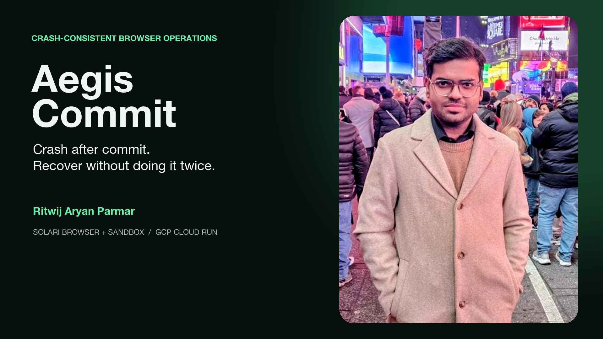

# Aegis Commit

> Crash after commit. Recover without doing it twice.

**[Public verified run](https://aegis-commit-demo-980932890834.us-east1.run.app/)** ·
[machine-readable evidence](https://aegis-commit-demo-980932890834.us-east1.run.app/evidence.json)

[](demo/aegis-commit-demo.mp4)

**[Watch the 64-second running demo](demo/aegis-commit-demo.mp4)** — live dashboard,
real recovery audit trail, executable verification, and public CI; no slides or
staged success screens.

Browser agents fail in the worst possible place: the remote system accepts a
purchase, payout, ticket, or configuration change, then the browser disappears
before the agent sees the success response. A naïve retry duplicates the side
effect. Refusing to retry leaves the workflow stuck forever.

Aegis Commit is a small execution protocol for that ambiguity. The live demo:

1. boots an idempotent target inside a Solari sandbox;
2. launches a recorded Solari browser and submits a synthetic vendor payment;
3. commits the payment in the sandbox but delays the HTTP acknowledgement;
4. terminates the browser during that delay;
5. records `outcome_unknown` in a hash-chained write-ahead log;
6. launches a fresh recovery browser to look up the authoritative receipt; and
7. marks the operation committed without issuing a second payment.

This is not an LLM wrapper. It is the control plane an LLM-driven browser needs
before it is allowed to make expensive or irreversible changes.

## What is actually guaranteed

Exactly-once delivery is impossible in an asynchronous system. Exactly-once
*effects* are achievable only when the destination exposes at least one of these
primitives:

| Destination capability | Aegis behavior | Claim |
| --- | --- | --- |
| Idempotency key + receipt lookup | Bind key to canonical intent; reconcile after unknown outcome | Exactly-once effect |
| Receipt lookup, no idempotency | Read before retry; require an immutable business key | Effectively-once, target-specific |
| Idempotency key, no lookup | Safe retry with identical canonical intent | Exactly-once effect, weaker recovery evidence |
| Neither | Stop and escalate | No false guarantee |

The example uses the strongest case. Reusing an idempotency key with a changed
amount returns `409`; it never silently aliases a different operation.

## Architecture

```mermaid
sequenceDiagram
    participant C as Aegis coordinator
    participant W as Hash-chained WAL
    participant B1 as Solari browser #1
    participant S as Solari sandbox target
    participant B2 as Recovery browser #2

    C->>W: PREPARE(intent hash + idempotency key)
    C->>B1: dispatch canonical operation
    B1->>S: POST /api/effects
    S->>S: persist receipt and effect
    S--xB1: delayed acknowledgement; browser terminated
    C->>W: OUTCOME_UNKNOWN
    C->>B2: authoritative receipt lookup
    B2->>S: GET /receipts/{key}
    S-->>B2: immutable receipt
    B2-->>C: matching intent hash
    C->>W: COMMIT without retry
```

The coordinator is a finite-state machine:

```text
PREPARED → DISPATCHING → COMMITTED
                      ↘ OUTCOME_UNKNOWN → RECONCILING → COMMITTED
                                                     ↘ VERIFIED_ABSENT → RETRY
```

Every audit event includes its predecessor hash. A changed amount, state, or
timestamp breaks verification of the rest of the chain. See
[ARCHITECTURE.md](ARCHITECTURE.md) for invariants and recovery semantics.

## Run it

Requirements: Node.js 20+, pnpm, and a Solari key for the live path.

```bash
pnpm install
pnpm check

# Deterministic fault matrix; never calls Solari.
pnpm demo:local

# Real sandbox + browser sessions + recordings.
export SOLARI_API_KEY=YOUR_SOLARI_API_KEY
pnpm demo
```

Both commands generate:

- `evidence/latest/index.html` — human-readable run dashboard;
- `evidence/latest/evidence.json` — versioned machine-readable result;
- `evidence/latest/audit.jsonl` — tamper-evident state transitions; and
- `evidence/latest/live-audit.jsonl` — live Solari WAL when a key is present.

The local run covers 100 deterministic schedules. The live run adds the critical
`commit → lost acknowledgement → recovery read` path against real Solari
infrastructure.

Validate the checked-in evidence independently:

```bash
pnpm verify:evidence
```

## Deploy the evidence dashboard

The committed container serves only sanitized evidence. Opaque Solari resource
identifiers are reduced to one-way fingerprints before serialization; signed
preview parameters and API credentials never enter the image.

```bash
gcloud run deploy aegis-commit-demo \
  --source . \
  --region us-east1 \
  --allow-unauthenticated
```

The image runs as an unprivileged user, exposes `/ready`, and sends CSP,
clickjacking, MIME-sniffing, referrer, and permissions-policy headers.

## Failure matrix

| Injected failure | Authoritative observation | Recovery decision |
| --- | --- | --- |
| Browser dies before send | No receipt | One verified retry |
| Browser dies after commit, before acknowledgement | Matching receipt | Do not retry |
| Twenty callers race on one business key | One in-flight owner | Coalesce callers |
| Same business key, different amount | Intent hash mismatch | Reject before dispatch |
| Audit event edited | Hash-chain mismatch | Refuse recovery |
| Target offers no lookup and no idempotency | Outcome unknowable | Stop; require human resolution |

## Why Solari

- **Sandbox:** runs the isolated target service and persists the authoritative
  receipt independently of the browser process.
- **Browser:** executes the real form flow, records the session, and can be
  killed without destroying target state.
- **Fresh browser recovery:** demonstrates that correctness does not depend on
  a surviving page, DOM, or JavaScript context.
- **Public port preview:** makes the in-sandbox fixture reachable through the
  same network boundary as a real external service.

The deterministic adapter is deliberate, not a mock passed off as production.
It keeps CI keyless and exhaustive; the evidence schema labels runs as either
`deterministic` or `solari-live`.

## Engineering notes

- The write-ahead log calls `fsync` before dispatch state can advance.
- Business keys are bound to a canonical SHA-256 intent hash.
- Concurrent callers share one in-flight promise per operation.
- A retry is permitted only after an authoritative lookup returns absence.
- Receipts are checked against key, intent hash, and amount before commit.
- Solari sandboxes are always killed in `finally`; browser clients are closed.
- Secrets enter only through `SOLARI_API_KEY` and never appear in artifacts.
- CI runs strict TypeScript, all tests, evidence verification, and a
  high-severity dependency audit.

## Scope

The payment target is synthetic and moves no money. It models any high-stakes
browser side effect: approving a vendor, creating a cloud key, publishing a
release, changing an access policy, or submitting a procurement order.

For a production deployment, replace the JSONL WAL with PostgreSQL or another
linearizable store, use target-issued receipt signatures, and fence concurrent
workers with leases. The protocol and adapters are intentionally separated so
those changes do not touch the state machine.
