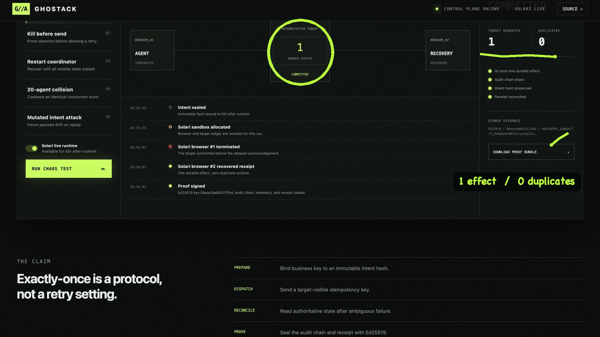

# GhostAck

> Kill the browser. Prove the action happened only once.

GhostAck is a chaos-testing control plane for browser agents. It deliberately terminates an agent in the ambiguous window between a server-side commit and the client receiving an acknowledgement, then proves whether recovery is safe.

**[Open the interactive control lab](https://ghostack-control-lab-980932890834.us-east1.run.app/)**

[](demo/ghostack-demo-v2.mp4)

**[Watch the 91-second running demo](demo/ghostack-demo-v2.mp4)** — a fresh Solari live failure, a 20-agent collision, conversational first-person narration, and animated pen annotations over the real GCP product.

This is not a prerecorded result page. A reviewer can trigger five executions:

| Failure injection | What GhostAck must prove |
| --- | --- |
| Kill after commit | An authoritative receipt exists, so retry is suppressed |
| Kill before send | Absence is proven before one fenced retry is released |
| Restart coordinator | A fresh process recovers using only durable state |
| 20-agent collision | Concurrent identical calls collapse to one target request |
| Mutated intent attack | A reused business key with changed payload is rejected |

Every passing run ends with one durable effect, zero duplicates, a hash-chained audit journal, an OTLP-shaped trace with W3C trace/span IDs, and an Ed25519-signed proof bundle.

## Why this is a systems project

“Retry on timeout” is unsafe for side effects. A timeout says nothing about whether the target committed. GhostAck uses four target-level primitives instead:

1. **prepare** — bind a business key to an immutable intent hash;
2. **dispatch** — carry a target-visible idempotency key;
3. **reconcile** — read authoritative state after an ambiguous outcome;
4. **prove** — seal the audit chain and target receipt into a signed artifact.

If a target cannot provide idempotency or an authoritative reconciliation read, GhostAck fails closed and does not claim exactly-once behavior.

## Production boundaries

- `PostgresAuditLog` provides a transactional, hash-chained journal and is exercised against PostgreSQL 16 in CI.
- `GitHubIssueTarget` is a real external-side-effect adapter for a deliberately configured disposable repository. The public lab does not create GitHub issues without the repository owner's credentials.
- `SolariEffectTarget` runs the target ledger in a Solari sandbox and uses two independent Solari browsers to demonstrate lost acknowledgement and recovery.
- `EvidenceSigner` signs proof payloads with Ed25519. Production deployments can inject a private signing key; no secret is returned to the browser.
- The public live path has a one-minute cooldown and only exposes the bounded kill-after-commit drill.

## Run locally

```bash
pnpm install
pnpm check
pnpm start
```

Open `http://localhost:8080`. Deterministic failure injection needs no credentials. To enable the live Solari toggle, provide `SOLARI_API_KEY` through your shell or secret manager.

## Evidence model

The downloadable proof contains immutable run and operation IDs, target request/effect/duplicate counts, the chained audit journal, execution trace, SHA-256 digest, Ed25519 signature, public key, and key ID. Verification is local and does not trust the control plane that produced the proof.

## Threat model

GhostAck addresses duplicated external effects caused by client crashes, network ambiguity, coordinator restarts, concurrent callers, payload mutation, and audit tampering. It does not pretend to solve a malicious target, a target that lies during reconciliation, or an effect API with neither idempotency nor authoritative reads. See [THREAT_MODEL.md](THREAT_MODEL.md).

Built by **Ritwij Aryan Parmar** for the Solari engineering challenge.
